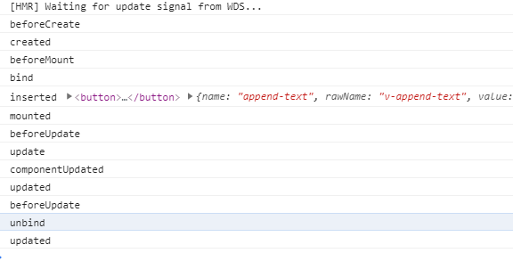

### 内置指令-语法糖


**v-text:**

将标签内的内容**替换**为=后面的内容

```html
<div v-text="'hello vue'">
	hello world
</div>
```


**v-html:**

将标签内的内容替换为标签, 不建议使用, 有xss风险

```html
<div v-html="'<span style=&quot;color: red&quot;>hello vue</span>'">
    hello world
</div>
```


**v-show:**

是否显示

```html
<h2>v-show</h2>
<div v-show="show">hello vue</div>
<button @click="show = !show">change show</button>
```


**v-if / v-else-if / v-else:**

同样是是否显示, 但是v-show为隐藏, 但v-if直接删掉

```html
<h2>v-if v-esle-if v-else</h2>
<div v-if="number === 1">hello vue {{ number }}</div>
<div v-else-if="number === 2">hello world {{ number }}</div>
<div v-else>hello geektime {{ number }}</div>
```


**v-bind / v-for:**

v-bind对数值进行绑定, 简写为" : "

v-for遍历

```html
<h2>v-for v-bind</h2>
    <div v-for="num in [1, 2, 3]" v-bind:key="num">hello vue {{ num }}</div>
```


**v-on:**

绑定事件监听器

```html
<h2>v-on</h2>
<button v-on:click="number = number + 1">number++</button>
```


**v-model:**

双向绑定的语法糖

```html
<h2>v-model</h2>
<input v-model="message" />
```


**v-pre:**

里面的内容绕过编译过程直接输出

```html
<h2>v-pre</h2>
    <div v-pre>{{ this will not be compiled }}</div>
```


**v-once:**

内容仅渲染一次

```html
<h2>v-once</h2>
<div v-once>
  {{ number }}
</div>
```


v-cloak, 在cil下没有任何用, 而且不常用, 就不谈了


### 自定义指令

自定义指令是由开发者自定义功能的指令, 一般自定义指令并不常用, 并且自定义指令可以完成的事情均可以通过属性传递的方式进行完成, 但在大型项目中为了统一以及复用才会用到自定义指令

在自定义指令中, 一般通过自定义指令的四个声明周期来实现相关功能

bind->inserted->update->componentUpdate->unbind

```html
<template>
  <div>
    <button @click="show = !show">
      销毁
    </button>
    <button v-if="show" v-append-text="`hello ${number}`" @click="number++">
      按钮
    </button>
  </div>
</template>
<script>
export default {
  directives: {
    appendText: {
      bind() {
        console.log("bind");
      },
      inserted(el, binding) {
        el.appendChild(document.createTextNode(binding.value));
        console.log("inserted", el, binding);
      },
      update() {
        console.log("update");
      },
      componentUpdated(el, binding) {
        el.removeChild(el.childNodes[el.childNodes.length - 1]);
        el.appendChild(document.createTextNode(binding.value));
        console.log("componentUpdated");
      },
      unbind() {
        console.log("unbind");
      }
    }
  },
  data() {
    return {
      number: 1,
      show: true
    };
  }
};
</script>

```

四个声明周期分别对应  绑定->初始化操作->更新->更新操作->解绑

对于update以及componentUpdated两个函数当自定义指令绑定的数据变动时才会调用, 在上面的例子中是`hello ${number}`


### 自定义指令的生命周期及vue自身的生命周期	




对比上面的两张图可以看到, 自定义指令的所有阶段均存在于render部分,  其中bind和inserted在创建阶段, update和componentUpdated以及unbind均在更新阶段被调用

