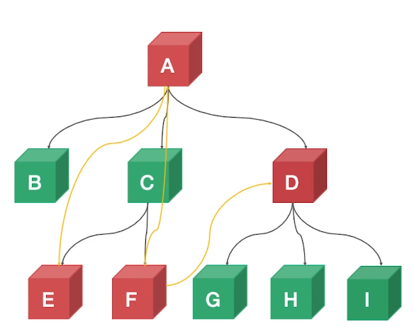

### 跨组件获得组件实例

```html
标签
<p ref="p">
    hello
</p>
组件
<child-component ref="child"></child-component>
```

我们可以使用`vm.$refs.p`以及`vm.$refs.child`的方式来获取**当前层级**挂载的组件实例, 对于实际存在的标签我们获取的是他的DOM, 对于自定义组件, 我们获取的是他的组件实例

对于简单的仅有几级的组件获取组件实例的时候我们可以通过parent.$ref.xxx,  children.$ref.xxx来跨层级获取组件实例, 但对于多层组件却显得复杂, 重点是这样的方式无法判断更新, 每次调用都需要重新进行获取, 无法进行缓存


callback ref

- 主动通知 (setXxxRef)
- 主动获取 (getXxxRef)



类似于上面这种层级关系A想获取E的实例, 那么只需要A生成一个钩子函数, E更新时主动的调用这个钩子函数来通知A结点, 然后A结点进行缓存, 使得每次的使用都能使得是最新的