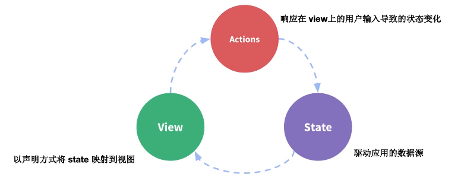
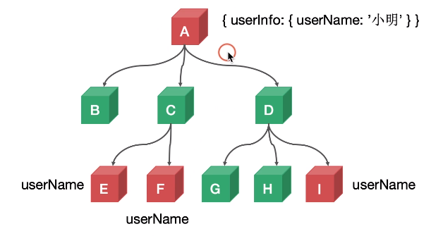
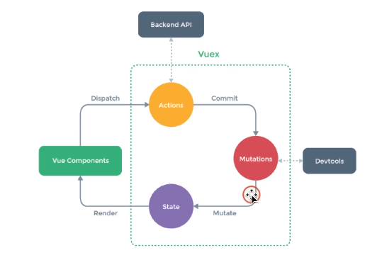

### 为什么需要vuex

**vuex是一种状态管理器**

对于vue的单向数据流, vue是一种数据驱动的框架, 一般来说流程是这样的:

数据驱动视图 更新, 然后然后用户在view上的操作触发Actions , 然后通过Actions来更新数据, 最后通过数据重新映射视图, 但是在组件中经常会有一个数据在多个组件中使用的情况: 

一个数据在多处被同时应用, 并且要求当一个数据被修改的时候所有的数据要同步更新, 笨方法是可以在公共父节点上声明, 然后层层传递在子节点调用, 但是这样的传递和更新方式极为脆弱而且繁琐, 聪明一点的方法是可以用之前说过的provide_inject, A结点 provide然后子节点进行inject, 但是当一个项目无比复杂的时候, 这样的方法似乎也显得不太聪明,需要一个更加系统化的状态管理机制, 这样就有了我们的vuex发挥作用的地方:

- 动态注册响应式数据
- 命名空间管理数据组织数据
- 通过插件记录数据的更改,方便调试

从这张图可以很好的理解vuex的运行机制,  通过vue组件来派发数据, 然后Action提价数据到Muations然后改变State最后更变vue组件 , 他与provide_inject不同, 他完全脱离了vue组件, 至于为什么会有actions和mutations两个中间层:

acitons这一层中执行我们的异步操作, 可以通过AJAX对后台进行异步操作

mutations 中我们记录数据的更变, 来方便后期的调试

当然如果我们没有异步操作也可以直接跳过actions这一步, 直接commit到mutations