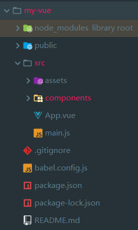

### vue单文件组件

*对于但组件开发的第一步*

1. 搭建脚手架  vue create <name>  (需要安装vue-ceil)
2. cd <name> (进入项目文件)
3. npm run serve 运行项目


成功后的图片





源码, 静态文件, 实际的项目文件夹, 项目中包的版本, readme.....


src/components文件夹一般放入单个组件,实现对于单文件组件的开发

一个简单组件的写法

```vue
<template>
    <li class="item">
        <!--作用域插槽 双向绑定值-->
        <input type="checkbox" v-model="checked">
        <!--将上面的值传递出去-->
        <!--子组件传递状态给父组件使用-->
        <slot name="item" v-bind="{checked}"></slot>
    </li>
</template>

<script>
    export default {
        props: ['item'],
        data(){
            return{
                checked: false
            }
        }
    }
</script>

<!--添加scoped 为局部作用域-->
<!--
scope:

英 /skəʊp/  美 /skop/
n. 范围；余地；视野；眼界；导弹射程
vt. 审视
过去式scoped
过去分词scoped
现在分词scoping
-->
<style scope>
    .item{
        color: red;
    }
</style>
```


对于引用页面需要将模板引入


```html
<template xmlns:v-slot="http://www.w3.org/1999/XSL/Transform">
    <div id="app">
        {{msg}}
        <div>
            <!--双向绑定 v-model 同步更新到 info 中-->
            <input type="text" v-model="info">
            <!--v-on: 简写为 @-->
            <button @click="handleClick">添加</button>
        </div>
        <ul>
            <!--<li v-for="item in list">{{item}}</li>-->
            <!--v-bind: 简写为 ":" 组件中的props: ['item']-->

            <!--<todo-item v-for="item in list" :key="item" :item="item"></todo-item>-->

            <!--插槽形式的数值绑定-->
            <todo-item v-for="item in list" :key="item">
                <!--这里是vue2.6以后的新语法, 之前的语法3.0以后会被抛弃-->
                <!--这样的为具名插槽-->
                <!--itemProps绑定获取从作用域插槽中得到的值-->
                <template v-slot:item="itemProps">
                    <span :style="{fontSize: '20px', color: itemProps.checked ? 'red': 'blue'}">{{item}}</span>
                </template>
            </todo-item>
        </ul>
    </div>
</template>

<script>
    // 引入
    import TodoItem from './components/TodoItem'

    export default {
        name: 'app',
        data() {
            return {
                info: "",
                msg: "hello my-vue",
                list: [],
            }
        },
        methods: {
            handleClick() {
                console.log(this.info);
                this.list.push(this.info);
                // 清空输入栏
                this.info = '';
            }
        },
        // 注册
        components: {
            TodoItem
        }
    }
</script>

<style>

</style>
```


*区别于使用v-bind将数据进行绑定进入插件内部的写法, 这里使用了插槽的写法*

**对于插槽:**

目前介绍具名插槽和作用域插槽

**对于具名插槽:**

*对于具名插槽,我的理解是将模板调用文件中的代码或数据插入到模板文件中,所以不需要对后台文件进行绑定*

使用vue2.6以后的写法,组件使用时:

```html
<todo-item v-for="item in list" :key="item">
    <template v-slot:item>
        {{item}}
    </template>
</todo-item>
```

使用 template 声明一个插槽,  其中v-slot: item 为将slot命名为item 

后台将插槽 name="item"

```vue
<template>
    <li class="item">
        <slot name="item"></slot>
    </li>
</template>
```


**对于作用域插槽:**

*对于作用域插槽, 作用相反, 是将模板中的一些内容返回到调用页面中, 达到子模板向父页面传递的作用*

```vue
<template>
    <li class="item">
        <!--作用域插槽 双向绑定值-->
        <input type="checkbox" v-model="checked">
        <!--将上面的值传递出去-->
        <!--子组件传递状态给父组件使用-->
        <slot name="item" v-bind="{checked}"></slot>
    </li>
</template>
<script>
    export default {
        props: ['item'],
        data(){
            return{
                checked: false
            }
        }
    }
</script>
```

上面的input双向绑定了checked值, slot将这个值传递出去

```html
<todo-item v-for="item in list" :key="item">
    <!--这里是vue2.6以后的新语法, 之前的语法3.0以后会被抛弃-->
    <!--这样的为具名插槽-->
    <!--itemProps绑定获取从作用域插槽中得到的值-->
    <template v-slot:item="itemProps">
        <span :style="{fontSize: '20px', color: itemProps.checked ? 'red': 'blue'}">{{item}}</span>
    </template>
</todo-item>
```

外面通过v-slot:item="itemProps"获取组件向外传递的值  itemProps.checked 获取checked

这里想实现的效果是checkbox被点击是红色, 没有是蓝色


对于简单的vue页面的另一个特点是拥有作用域的style标签

```vue
<style scoped>
    .item{
        color: red;
    }
</style>
```

当我们使用这样的东西放入组件文件中的时候, scoped会规定他的作用域范围仅仅作用域组件之中,不会污染全局style


**后面的文章会更加详细的解释插槽等相关概念**