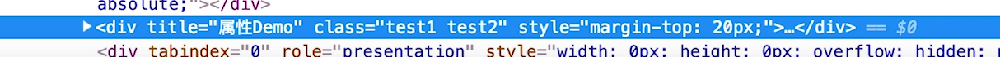
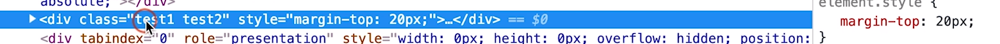

### vue属性

在vue中, 属性分为三大种, *自定义属性*, *原生属性*, *特殊属性*

|      | 自定义属性(props)       | 组件props中声明的属性                                        |
| ---- | ----------------------- | ------------------------------------------------------------ |
| 属性 | 原生属性 (attrs)        | 没有声明的属性,默认自动挂在到组件根元素上,设置inheritAttrs为false可关闭自动挂载 |
|      | 特殊属性 class ,  style | 挂载到组件根元素上, 支持字符串, 对象, 数组等多种语法         |

**继承于普通html的概念, 对于组件的属性,我的理解是相当于父页面在调用子组件的时候向子组件传的值, 用于规定**

**子组件的样式等**


在子组件中对于属性的设定的时候有两种:

```vue
props: ['name', 'type', 'list', 'isVisible']
```

声明了子组件中的四种属性, 但是不建议这么写

优点: 简单,方便

缺点: 不宜维护


推荐写法:

```vue
<template>
    <div>
        name: {{ name }}
        <br />
        type: {{ type }}
        <br />
        list: {{ list }}
        <br />
        isVisible: {{ isVisible }}
        <br />
        <button @click="handleClick">change type</button>
    </div>
</template>

<script>
export default {
        name: "PropsDemo",
        // inheritAttrs: false,
        // props: ['name', 'type', 'list', 'isVisible'],
        props: {
            // 类型
            name: String,
            type: {
                // 自定义校验
                validator: function(value) {
                    // 这个值必须匹配下列字符串中的一个
                    return ["success", "warning", "danger"].includes(value);
                }
            },
            list: {
                type: Array,
                // 对象或数组默认值必须从一个工厂函数获取
                default: () => []
            },
            isVisible: {
                type: Boolean,
                default: false
            },
            onChange: {
                type: Function,
                default: () => {}
            }
        },
        methods: {
            handleClick() {
                // 不要这么做、不要这么做、不要这么做
                // this.type = "warning";
                // 可以，还可以更好
                this.onChange(this.type === "success" ? "warning" : "success");
            }
        }
    };
</script>
```

规范写法, 这里主要是规定了 **数据类型** ,**默认值**, **自定义校验**, 

这里注意的是:

**不要用this.属性去改变 属性值, 从理论上讲子组件内不应该直接去改变父页面调用的值, 应该使用onChange去改变**


对于组件属性的的自动挂载

先看上面这个组件的调用

```vue
<template>
    <Props
    name="Hello Vue！"
    :type="type"
    :is-visible="false"
    :on-change="handlePropChange"
    title="属性Demo"
    class="test1"
    :class="['test2']"
    :style="{ marginTop: '20px' }"
    style="margin-top: 10px"
    />
</template>
```

 在组件中使用的属性有:  'name',  'type',  'list',  'isVisible', 'onChange'

对于 title class style 组件中并未声明

其中class style为原生属性, 但是title为自定义属性, 但是组件中并**未调用**, 当运行的时候会自动挂载到组件的根节点上



我们可以主动关闭自动挂载的功能, 在组件中将**inheritAttrs: false**可以关闭挂载功能, 关闭后:




对于上面的属性有的有"  : " 有的没有, 这是 **因为加冒号的，说明后面的是一个变量或者表达式，没加冒号的后面就是对应的字符串字面量**

[Class 与 Style 绑定]: https://cn.vuejs.org/v2/guide/class-and-style.html	"官方文档"

