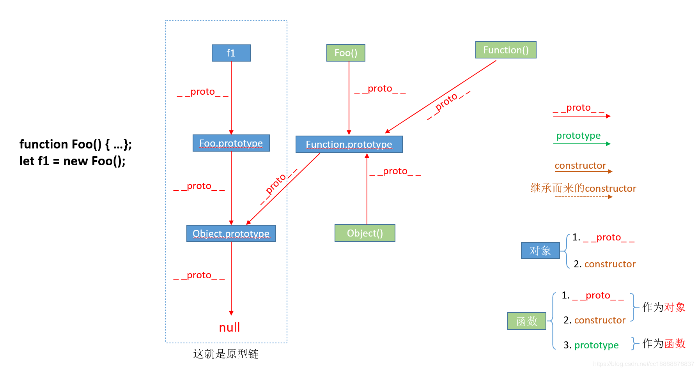

### 原型链, 属性与new

什么是原型链?

原型链是一个在js中承担类似继承的作用的, 以对象为结点, _ _ proto _ _属性为连线的一串对象链,  当我们在一个对象中去调用某个属性点的时候, 如果这个对象没有这个属性, 那么这个对象将会顺着 _ _ proto _ _ 向上层对象去寻找这个属性, 直到找到或者所以的对象都不存在这个属性, 则返回null

```js
下图是这段代码的__proto__关系
function Foo(){}
let f1 = new Foo();
```




我们对于原型链还有诸多疑问, 比如上面这个图, 当我们new了一个函数对象的时候为什么会有如此复杂的 _ _ proto _ _ 指向? 但是在回答这些疑问之前, 我们要先知道在原型链中的 _ _ proto_ _ 是干什么的, 从哪来起到了什么作用


### _ _ proto _ _  / prototype / constructor

这仨是啥? 没错是属性, 在资料中说 _ _ proto _ _ 和 constructor是对象独有的, prototype是函数独有的, 而函数又是对象所以函数也有 _ _ proto _ _ 和 constructor, 说的很复杂其实只要知道对象没有prototype属性就可以了

- _ _ proto _ _:

_ _ proto _ _ 属性的作用是标明指向当前对象的父对象, 以便当某个没有的属性被调用时可以顺着_ _ proto _ _ 来向父对象来寻找我们需要的对象

- prototype:

prototype属性是指向函数的构造对象, 函数.prototype本身就是个对象, 为了方便当我们实例化这个函数的时候可以找到里面的属性和方法, 所以当我们在实例化一个对象之后想要向对象中添加属性的时候我们可以使用这样的写法:

```js
function Foo(){}
let f1 = new Foo();
f1.prototype.name = "aaa"
```

- constructor:

constructor属性与prototype相反constructor指向的是对象的构造函数, 所以  函数.prototype.constructor === 函数本身, 而且作为一个属性哪怕函数函数构建的对象没有constructor, 也能通过原型链向上找到拥有constructor的对象, 将constructor继承过来(与父对象指向相同)


然后来一张完整的关系图


到了这里你应该能看懂一点了, 如果还有不懂那么我想应该是不太清楚`new`这个关键字到底干了什么

### new

其实在js中new关键字更像一颗语法糖, 总共有四步, 完全可以通过手动来实现

以function Foo(param){};  let f1 = new Foo(param); 来举例

```js
new Foo(param) = {
    // 第一步新建一个对象
    let obj = {};
	// 第二步, 将新对象的__proto__指向函数对象的构造对象
	obj.__proto__ = Foo.prototype;
	// 第三步修改obj的上下文, 将新对象的上下文与Foo一致, 不明白你可能需要理解一下call, apply, bind
	var result = Foo.call(obj, param);
	// 第四步, 判断第三步返回值, 无返回值或者返回值不是一个对象, 那么将obj作为新对象返回否则返回result
	return typeof result === 'object' ? result : obj;
}
```


参考: